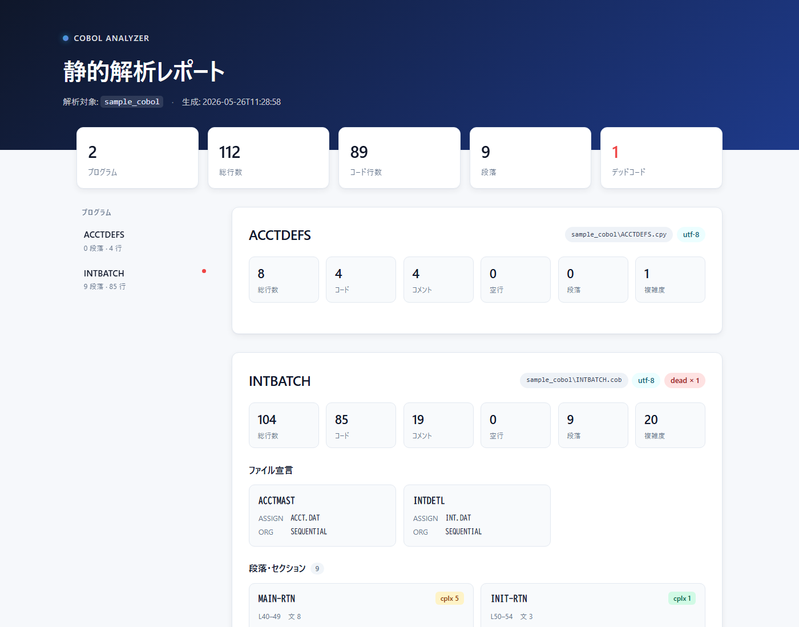

# COBOL Analyzer

レガシー COBOL ソースの静的解析と仕様書化を行う Python ツール。
段落・CALL/COPY・CRUD・複雑度メトリクス・デッドコード候補を抽出し、
HTML レポートと JSON で出力します。Claude API を使った自然言語仕様生成
（オプション）も同梱しています。

> **Static analyzer for legacy COBOL.** Extracts paragraphs, call graphs,
> CRUD matrices, complexity metrics and dead-code candidates; renders them
> as a Japanese-language HTML report. Optional AI specification layer using
> the Anthropic API.



🔗 **ライブデモ** — サンプル COBOL（口座利息計算バッチ）に対するレポート:
[cobol-analyzer.vercel.app](https://cobol-analyzer.vercel.app/) （※デプロイ後に有効）

## 特徴

- **コアは Python 標準ライブラリのみ** — 解析エンジンは外部依存ゼロで動く
- **AI レイヤーは隔離** — `anthropic` SDK と Claude API キーがある場合のみ自然言語仕様を付加
- **多言語コードページ対応** — UTF-8 / CP932 (Shift_JIS) を自動判定
- **固定形式 COBOL** に対応（COBOL-85 ベース、`EXEC SQL` 埋め込み SQL も拾う）
- **キャッシュ** — AI 出力は `.ai_cache/` に SHA256 キーで保存し、同じ入力では再課金しない

## 抽出する情報

1. プログラム / 段落単位の構造とソース位置
2. `CALL`（静的・動的）と `COPY` の参照
3. ファイル CRUD（`OPEN INPUT/OUTPUT/I-O/EXTEND` + `READ` / `WRITE` / `REWRITE` / `DELETE`）
4. 埋め込み SQL の CRUD（`EXEC SQL` ブロックから `SELECT` / `INSERT` / `UPDATE` / `DELETE`）
5. メトリクス（総行数 / コード行 / コメント行 / 文数 / 循環的複雑度の近似値）
6. デッドコード候補（`PERFORM` / `GO TO` から到達されない段落）

## クイックスタート

### 静的解析のみ（外部依存なし）

```bash
python cobol_analyzer.py sample_cobol -o analysis_report.html -j analysis.json
```

### AI 仕様書付き

```bash
pip install anthropic
export ANTHROPIC_API_KEY=sk-ant-...
export COBOL_AI_MODEL=claude-sonnet-4-6   # 任意（既定値）
python analyze_ai.py sample_cobol -o analysis_report_ai.html -v
```

Windows PowerShell の場合:

```powershell
$env:ANTHROPIC_API_KEY = "sk-ant-..."
python analyze_ai.py sample_cobol -o analysis_report_ai.html -v
```

## オプション

| フラグ | 説明 |
| --- | --- |
| `-o, --output` | HTML レポートの出力パス（既定: `analysis_report.html`） |
| `-j, --json` | JSON 解析結果の出力パス（省略時は出力しない） |
| `--encoding` | 強制エンコーディング（`utf-8` / `cp932` など） |
| `--no-paragraph` | 段落単位の AI 説明をスキップ（`analyze_ai.py` のみ） |
| `--dry-run` | API 呼び出しを行わない（キャッシュ済みのみ反映） |
| `-v, --verbose` | 進捗・エラーを stderr に出力 |

## 対応する拡張子

`.cob` `.cbl` `.cobol` `.pco` `.cpy` `.cpb`

## ファイル構成

```
.
├── cobol_analyzer.py      # 静的解析エンジン + HTML 生成（標準ライブラリのみ）
├── ai_spec.py             # AI 仕様書生成（Claude API + ディスクキャッシュ）
├── analyze_ai.py          # AI 版エントリポイント
├── sample_cobol/          # サンプル（口座利息計算バッチ + COPY ブック）
│   ├── INTBATCH.cob
│   └── ACCTDEFS.cpy
├── CLAUDE.md              # 設計メモ / Claude Code 用ガイド
├── ROADMAP.md             # フェーズ別タスク
├── README.md
└── LICENSE
```

## 既知の制限

- COPY 句の実体は展開していない（参照の記録のみ）
- メインフレーム方言（COBOL/370, ACUCOBOL 等）の差異は未検証
- 大規模ソース（10 万行クラス）での性能は未測定
- デッドコード検出は静的な PERFORM/GO TO のみ。動的 CALL や CICS のトランザクション制御は対象外
- 段落 1 件目を「エントリ」とみなすため、それより前に到達不能段落があると検出漏れする可能性あり

詳細は [ROADMAP.md](./ROADMAP.md) を参照してください。

## デモサイトを更新する

デモサイトの中身は `public/index.html` です。サンプルや解析ロジックを変えたら以下で再生成してください:

```bash
python cobol_analyzer.py sample_cobol -o public/index.html
git add public && git commit -m "Update demo report" && git push
```

Vercel に接続済みなら、push で自動的に再デプロイされます。

## レポートの中身

[`docs/screenshot-full.png`](./docs/screenshot-full.png) でレポート全体を確認できます。
プログラムごとに以下のブロックが並びます:

- ヒーロー（タイトル + 解析対象 + 生成日時）
- KPI ストリップ（プログラム数 / 総行数 / 段落数 / デッドコード）
- スティッキーサイドバー（プログラムごとのナビ。デッドコードがあれば赤ドット）
- AI 仕様サマリ（callout 形式）
- メトリクス（総行数 / コード / コメント / 空行 / 段落 / 複雑度）
- ファイル宣言（FD カードのグリッド）
- 段落・セクション（複雑度バッジ + dead タグ付きカード）
- CALL（フローリスト形式、動的 CALL は黄色バッジ）
- COPY（チップ表示）
- CRUD（対象ごとにグルーピング、READ=青 / CREATE=緑 / UPDATE=橙 / DELETE=赤）
- 警告（動的 CALL やパース失敗の通知）

## 貢献

Issue / Pull Request 歓迎です。COBOL 方言ごとの差異（特に EBCDIC 系メインフレームのソース）が分かるサンプルをお持ちの方は、`sample_cobol/` への追加もぜひ。

## ライセンス

[MIT](./LICENSE)
